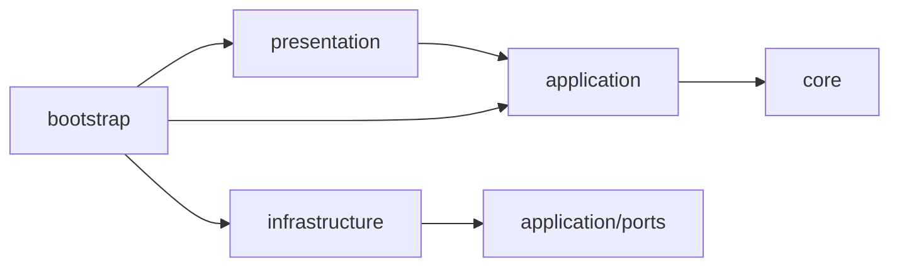

# アーキテクチャ

application、infrastructure、presentation、bootstrapからなる単一のCloudflare Worker。
現在の機能はヘルスチェック、LINE疎通確認、短期会話を踏まえたWorkers AIへの質問と回答。
会話はグループ別DOのSessionsで7日間保存する。定期通知はCronとD1の設定で処理する。
TerraformでD1、ジョブ用Queue、DLQを先に定義し、アプリ配備はWorkers Buildsを使う。
Queue consumerとDLQはTerraformで接続する。AI Gatewayの予算制限とCronもTerraformが管理する。

```text
src/
├── core/                      FailureCodeなど、層に依存しない共通定義
├── application/
│   ├── ports/                 ReplySender、TextGenerator、GenerationQueueなど外部依存の契約
│   ├── health/                ヘルスチェック
│   ├── conversation/          許可判定、ジョブ投入、生成結果の返信
│   ├── prompts/               秘書・要約のデフォルト指示
│   ├── memory/                必要時の会話要約
│   ├── reminder/              収集日の判定とPush通知
│   └── privacy/               後続の個人情報処理
├── infrastructure/
│   ├── line/                  署名検証とLINE APIへの返信
│   ├── persistence/d1/        生成・通知の重複防止と収集設定
│   ├── memory/                Sessionsと削除・保持期限のRepository
│   ├── ai/                  AI bindingとGateway経由の接続
│   ├── privacy/
│   └── queue/
├── presentation/
│   ├── router/                HTTPの受信、入力検証、応答変換
│   ├── queue/               Queueジョブの入力検証
│   └── scheduled/
├── bootstrap/                 環境変数を受け取り、実装を注入
└── index.ts                   Workerエントリーポイント
```

機能のないディレクトリには配置先を示す`.gitkeep`だけを置く。
domain層や専用entityクラスは設けない。
DB導入時はDrizzleのテーブル定義から型を推論し、同じデータ形を手書きで重複定義しない。
型の参照とSQLの実行は分け、SQLはRepositoryへ閉じ込める。

## 依存方向



applicationはLINE APIもWorkersのBindingsも知らず、portsの契約だけを利用する。
署名検証器と返信処理はbootstrapからrouterへ注入する。
依存方向はdependency-cruiserで検査する。
coreは他層や外部パッケージに依存しない。将来domainを設けた場合もcoreを参照できる。

## LINEの処理

1. 生の本文の署名を検証する。
2. ZodでWebhookを検証し、受信形式をapplicationの入力へ変換する。
3. グループではbot宛てのメンション、許可対象、コマンドを確認する。
4. `ping`は即返信。それ以外はQueueへ保存してからWebhookを完了する。
5. consumerで許可グループを再確認し、D1でイベントIDを確保してからWorkers AIを呼ぶ。
6. 短い生成はReply、受信後45秒以降はPushで回答を送る。

通常の発言と、他の人へのメンションには返信しない。
会話保存は返信判定より前に実行する。通常発言には返信しない。
許可グループの直近履歴と要約をWorkers AIへ送る。
本文と送信済み回答をDOへ保存する。QueueとDLQには本文を含めず、会話IDと世代番号を保持する。

## 判断の記録

採用理由、変更履歴、残る制約は[ADR一覧](adr/README.md)に記録する。
特に[ADR-0005](adr/0005-small-application-boundaries.md)が現在のレイヤー構成を定義する。
