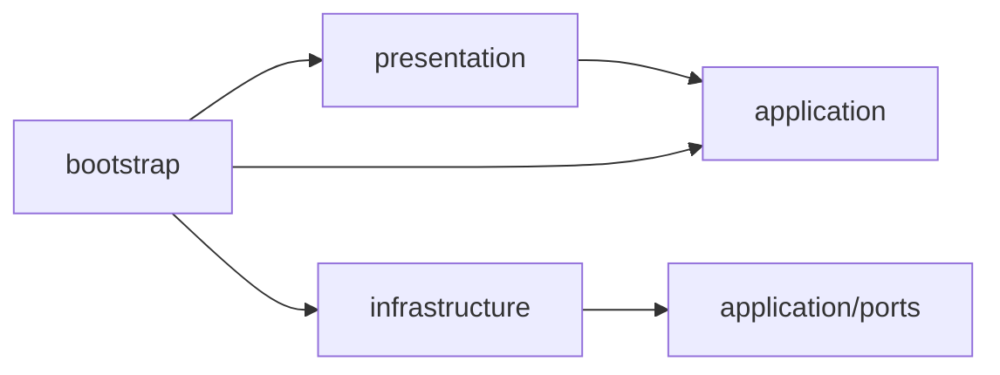

# アーキテクチャ

application、infrastructure、presentation、bootstrapからなる単一のCloudflare Worker。
現在の機能はヘルスチェックとLINEのメンション疎通確認。
記憶、DBアクセス、LLM、定期通知はまだ実装していない。
TerraformでD1、ジョブ用Queue、DLQを先に定義し、アプリ配備はWorkers Buildsを使う。
consumerとCronは処理実装後に接続する。

```text
src/
├── application/
│   ├── ports/                 ReplySenderなど外部依存の契約
│   ├── health/                ヘルスチェック
│   ├── conversation/          pingへの応答判断
│   ├── memory/                後続の記憶処理
│   ├── reminder/              後続の通知処理
│   └── privacy/               後続の個人情報処理
├── infrastructure/
│   ├── line/                  署名検証とLINE APIへの返信
│   ├── persistence/d1/        後続のRepository
│   ├── ai/
│   ├── privacy/
│   └── queue/
├── presentation/
│   ├── router/                HTTPの受信、入力検証、応答変換
│   ├── queue/
│   └── scheduled/
├── bootstrap/                 環境変数を受け取り、実装を注入
└── index.ts                   Workerエントリーポイント
```

機能のないディレクトリには配置先を示す`.gitkeep`だけを置く。
domain層や専用entityクラスは設けない。
DB導入時はDrizzleのテーブル定義から型を推論し、同じデータ形を手書きで重複定義しない。
型の参照とSQLの実行は分け、SQLはRepositoryへ閉じ込める。

## 依存方向



applicationはLINE APIもWorkersのBindingsも知らず、ReplySenderという契約だけを利用する。
署名検証器と返信処理はbootstrapからrouterへ注入する。
依存方向はdependency-cruiserで検査する。

## LINEの処理

1. 生の本文の署名を検証する。
2. ZodでWebhookを検証し、受信形式をapplicationの入力へ変換する。
3. グループではbot宛てのメンション、許可対象、コマンドを確認する。
4. `ping`に`pong`を返信する。

通常の発言と、他の人へのメンションには返信しない。
将来の会話保存は、返信判定より前の独立した処理として追加する。
現段階では会話を保存せず、LLMへ送信しない。

## 判断の記録

採用理由、変更履歴、残る制約は[ADR一覧](adr/README.md)に記録する。
特に[ADR-0005](adr/0005-small-application-boundaries.md)が現在のレイヤー構成を定義する。
