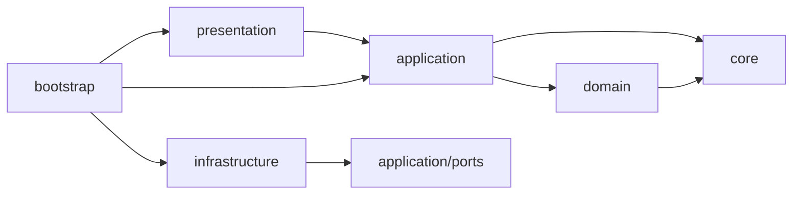

# アーキテクチャ

core、domain、application、infrastructure、presentation、bootstrapからなる単一のCloudflare Worker。
現在の機能はLINEでの会話、必要時の検索、記憶の保存・参照・削除、予定の管理と通知。
会話はグループ別DOのSessionsで7日間保存する。定期通知はCronとD1の設定で処理する。
TerraformでD1、ジョブ用Queue、DLQを先に定義し、アプリ配備はWorkers Buildsを使う。
Queue consumerとDLQはTerraformで接続する。AI Gatewayの予算制限とCronもTerraformが管理する。

```text
src/
├── core/                      FailureCodeなど、層に依存しない共通定義
├── domain/reminders/          繰り返し日時の純粋な計算
├── application/
│   ├── ports/                 ReplySender、TextGenerator、GenerationQueueなど外部依存の契約
│   ├── health/                ヘルスチェック
│   ├── conversation/          会話入力、回答、検索、DB参照結果の組み立て
│   ├── improvements/          改善依頼の確認・承認
│   ├── prompts/               秘書・要約のデフォルト指示
│   ├── memory/                非同期要約・長期記憶の抽出と操作
│   ├── reminder/              収集日の判定とPush通知
│   ├── reminders/             LINEからの通知管理・配信
│   └── privacy/               後続の個人情報処理
├── infrastructure/
│   ├── line/                  署名検証とLINE APIへの返信
│   ├── persistence/d1/        生成・通知の重複防止、予定、収集設定、長期記憶
│   ├── memory/                Sessionsと削除・保持期限のRepository
│   ├── ai/                    AI bindingとGateway経由の接続
│   ├── github/                承認した改善のActions起動
│   ├── search/                Tavily接続
│   ├── privacy/
│   └── queue/
├── presentation/
│   ├── router/                HTTPの受信、入力検証、応答変換
│   ├── queue/                 Queueジョブの入力検証
│   └── scheduled/
├── bootstrap/                 環境変数を受け取り、実装を注入
└── index.ts                   Workerエントリーポイント
```

機能のないディレクトリには配置先を示す`.gitkeep`だけを置く。
domain/remindersには繰り返し日時計算を置く。専用entityクラスは設けない（ADR-0015）。
現在のD1アクセスはSQL Repository。Drizzle導入時の推論型利用はADR-0005の方針であり、まだ導入していない。
型の参照とSQLの実行は分け、SQLはRepositoryへ閉じ込める。

## 依存方向



applicationはLINE APIもWorkersのBindingsも知らず、portsの契約だけを利用する。
署名検証器と返信処理はbootstrapからrouterへ注入する。
依存方向はdependency-cruiserで検査する。
coreは他層や外部パッケージに依存しない。domainはcoreを参照できる。

## LINEの処理

1. 生の本文の署名を検証する。
2. ZodでWebhookを検証し、受信形式をapplicationの入力へ変換する。
3. グループではbot宛てのメンション、許可対象、コマンドを確認する。
4. `ping`、記憶コマンド、改善の確認・承認は専用処理。会話生成が必要な場合はQueueへ保存してからWebhookを完了する。
5. consumerで許可グループを再確認し、D1でイベントIDを確保。DOで通知操作・予定参照の要否を判定し、必要な回答をGeminiで生成する。
6. 短い生成はReply、受信後45秒以降はPushで回答を送る。

会話保存と返信判定を分ける。botへのメンション・引用返信には回答する。
非メンションの通知関連候補はAIが参加の要否を判断し、不要なら沈黙する。スタンプは入口で無視する。
通知操作はD1へ保存し、5分Cron→Queue→家族DOからPushする。送信直前に状態とversionを照合する。
許可グループの直近履歴と要約をAI Gateway経由でGeminiへ送る。
本文と送信済み回答をDOへ保存する。QueueとDLQには本文を含めず、会話IDと世代番号を保持する。

## 回答と記憶整理

回答は直近の会話、保存済みの日別要約、関連するD1の長期記憶を参照する。回答前に要約はしない。
既存の5分Cronが未処理会話を確認し、Queue経由で別のGemini呼び出しによる整理を行う。
整理結果はコードで検証してから反映する。LLM待ちの間は会話のロックを保持しない。
記憶一覧と予定一覧はDBから直接作成する。期限・削除・容量は[記憶仕様](memory.md)を参照する。

自己改善は明示メンションの要望・承認からGitHub Actionsへ渡す独立した経路。Geminiによる生成、隔離した検証、Draft PR作成までを行う。通常会話の履歴や本番Secretsは実装AIへ渡さない。現在の受付・修正範囲は[自己改善](improvements.md)、判断の履歴は[ADR-0018](adr/0018-approved-improvements.md)と[ADR-0021](adr/0021-conversation-tools-and-improvements.md)。

## 記憶とツールの分担

| 情報 | 正本・使い方 |
| --- | --- |
| 直近の会話・日別要約 | DO。回答の背景として参照 |
| 明確な好み・習慣など | D1の長期記憶。関連するものを回答へ選択 |
| 登録通知・ゴミ収集設定 | D1。予定の質問時に読み取り専用inspectで取得 |
| 外部の最新情報 | 必要時にTavily検索 |
| コードの変更依頼 | 承認した仕様だけをGitHub Actionsへ送る |

inspectは既存の操作判定JSONを受けてbootstrapが固定Repositoryを呼ぶ方式。モデルがSQLや任意のツールを実行するものではない。取得結果は当該回答の参考データであり、長期記憶へ自動複製しない。範囲制限・省略を明示する。
詳細は[通知](reminders.md)、[記憶](memory.md)、[AI・検索](ai.md)を参照する。

## 判断の記録

採用理由、変更履歴、残る制約は[ADR一覧](adr/README.md)に記録する。
特に[ADR-0005](adr/0005-small-application-boundaries.md)が現在のレイヤー構成を定義する。
